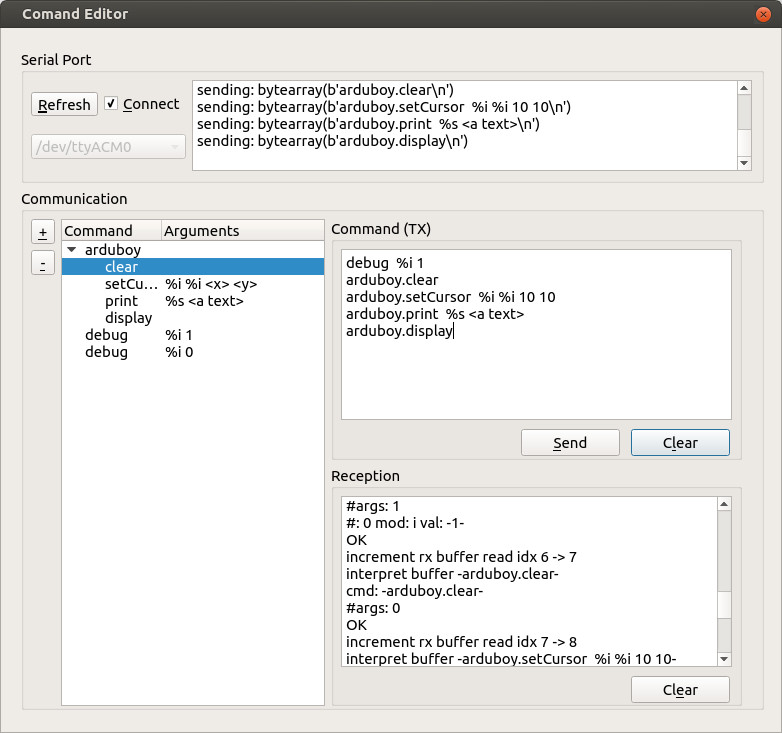

Arduboy Command Pass Through
============================
This is a simple program passing commands to the arduboy.
It interprets a string-based command in a very simple manner and executes the respecive arduboy commands.


Example
=======

```bash
ardu@boy:~$ stty -F $ARDUBOY_SERIAL 9600 cs8 -cstopb -parenb
ardu@boy:~$ echo "arduboy.clear"                 > $ARDUBOY_SERIAL
ardu@boy:~$ echo "arduboy.setCursor %i %i 30 30" > $ARDUBOY_SERIAL
ardu@boy:~$ echo "arduboy.print %s Hello World!" > $ARDUBOY_SERIAL
ardu@boy:~$ echo "arduboy.display"               > $ARDUBOY_SERIAL
```


Quick and Ddirty UI
===================
```bash
ardu@boy:~$ python ./controller-gui.py
```


